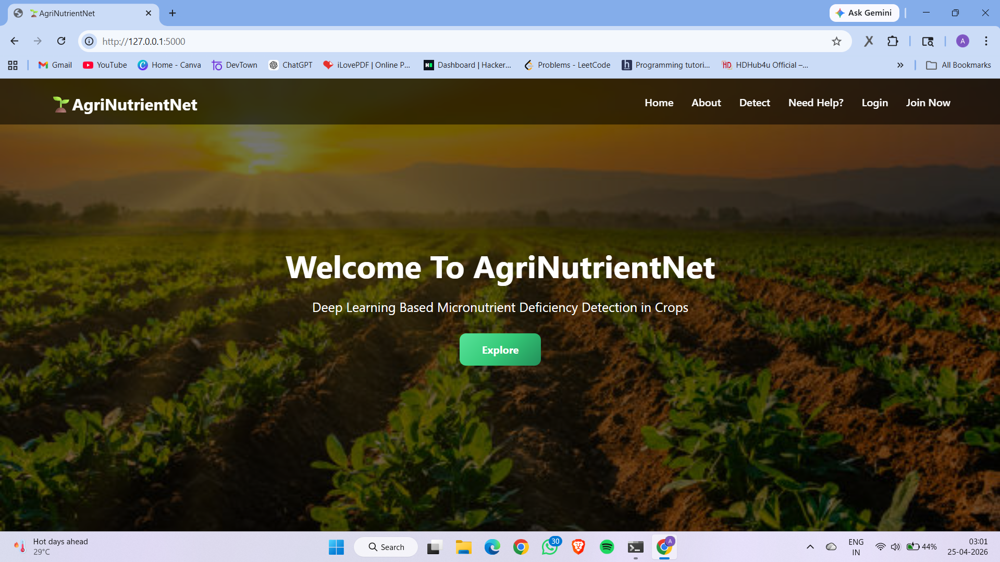
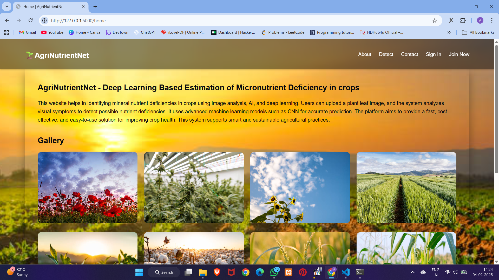
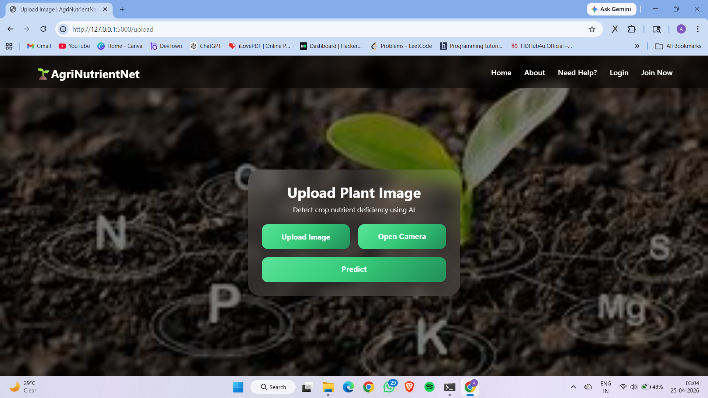
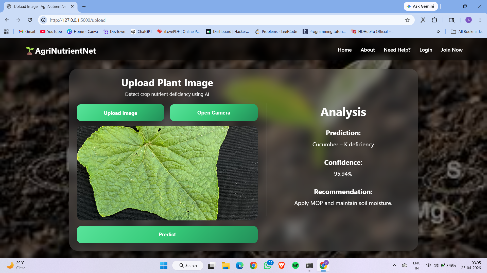
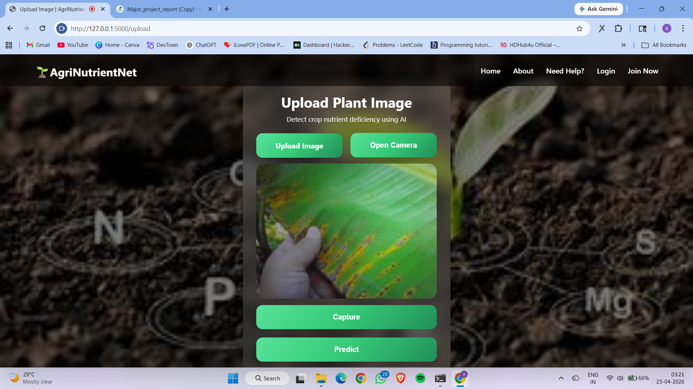
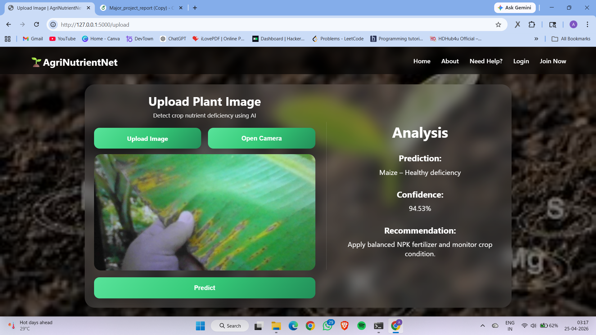
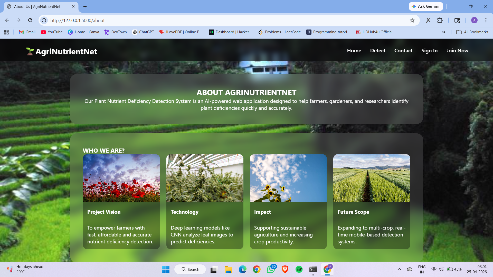
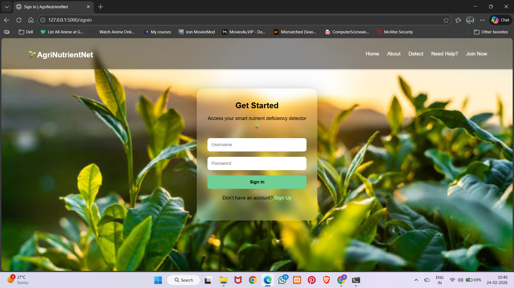
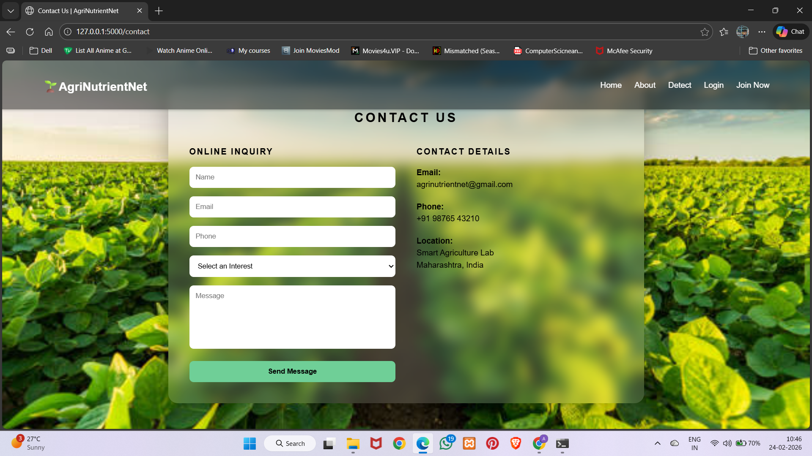

# AgriNutrientNet-Deep-Learning-Based-Estimation-of-Micronutrient-Deficiency-in-Crops
Deep Learning Based Crop Nutrient Deficiency Detection Web Application.

## 🚀 Features
- Detect crop type
- Detect nutrient deficiency
- Confidence score
- Fertilizer recommendation
- User login/signup
- Contact form

## 🧠 Supported Crops
- Banana
- Bottle Gourd
- Cucumber
- Maize
- Rice
- Tomato

## 🛠️ Tech Stack
- Flask
- TensorFlow
- Keras
- SQLite
- HTML
- CSS
- JavaScript

## 📂 Project Structure
app.py  
templates/  
static/  
models/
screenshots/

## 📸 Screenshots

### Index Page

### Home Page

### Detection Page

### About Page

### SignIn Page

### Contact Page

## ⚙️ Run Project
pip install -r requirements.txt  
python app.py

## 👩‍💻 Developer
Akanksha Kadam
